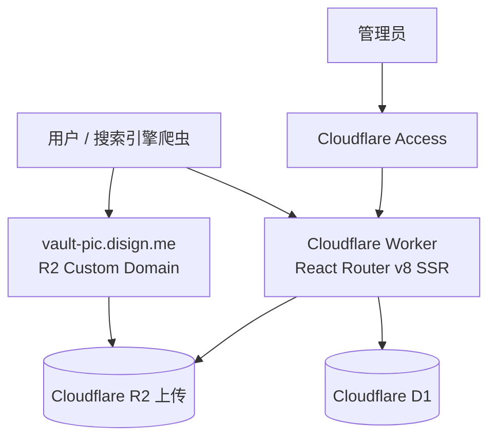

# Prompt Vault 技术方案 v0.2

> 状态：设计基线  
> 日期：2026-09-22  
> 目标：以最少的基础设施和运行时复杂度，实现一个 SEO 友好的文生图 Prompt 收藏与展示网站。

## 1. 产品目标与边界

Prompt Vault 用于沉淀和展示文生图 Prompt。公开页面以图片瀑布流为主要浏览入口，用户可按分类、标签浏览，进入详情页查看生成效果、Prompt、模型和画幅，并复制 Prompt。Prompt 可包含可选参数，使用户能在本地填写变量后复制最终文本。

后台仅面向站点管理员，用于维护 Prompt、变量、分类、标签和图片，并管理草稿、发布与删除。

首版包含：首页、详情、分类、标签、分页和加载更多、参数化 Prompt 复制、后台 CRUD、图片上传、草稿/发布、SEO、sitemap、robots、Open Graph、图片懒加载，以及 Cloudflare Access 后台保护。

首版不包含：普通用户账户、收藏/评论/投稿、在线调用模型、Prompt 自动改写、AI 自动分类、向量搜索、推荐算法、多角色 RBAC、独立搜索服务、独立 API Server、独立 Python 服务或 ORM。

## 2. 架构原则

### 2.1 单 Worker、单 TypeScript 技术栈

首版采用 React Router v8 SSR、TypeScript、Vite + Cloudflare Vite Plugin、Cloudflare Workers、D1、R2、Tailwind CSS + shadcn/ui 与 Cloudflare Access。页面渲染、表单提交、D1 读写和后台 R2 上传均在一个业务 Worker 中完成。

不增加 FastAPI、Node API Server、Docker、Nginx、MySQL、Redis 或额外运行单元。React Router route 处理 loader/action 与 SSR；不额外设计只供当前前端调用的 REST API。未来有公共 API、移动端或第三方集成的明确需求时，再增加 /api/*。

不引入 Python Worker：当前工作主要是 CRUD、筛选、SSR 和上传，第二种语言与运行时没有足够收益。出现批量分析、自动标签、模型调用、Embedding 或复杂数据处理时再评估。

不引入 ORM：使用 D1 Binding、参数化 SQL 和 migrations/*.sql。迁移不在应用启动时动态执行。

### 2.2 生产域名与资源边界

| 用途 | 固定地址 | 责任 |
| --- | --- | --- |
| 主站 | https://vault.disign.me | Cloudflare Worker Custom Domain，SSR 与后台上传 |
| 图片 | https://vault-pic.disign.me | R2 Custom Domain，直接公开读取对象 |

生产环境设置 IMAGE_BASE_URL=https://vault-pic.disign.me。D1 只保存 R2 object key，页面以该配置拼接公开图片 URL。Worker 只处理后台上传，不代理公开图片 GET。

生产环境关闭 R2 的 r2.dev 公共开发地址与 workers.dev；后台不以 preview 或备用访问入口对外提供。首版不启用会妨碍 Google 图片搜索或外部展示的全局 Referer 防盗链。未来发生明显盗链时，再评估 WAF 或速率策略。

## 3. 总体架构



公共 GET 由 loader 查询 D1 并 SSR 输出 HTML；后台写请求由 action 完成鉴权、校验、D1/R2 写入。图片浏览器请求直接到 R2 Custom Domain，不经过 Worker。

## 4. 路由与 URL 生命周期

### 4.1 公共路由

| 路由 | 用途 | 索引规则 |
| --- | --- | --- |
| / | 首页瀑布流 | 可索引 |
| /prompt/:slug | Prompt 详情 | 核心索引页 |
| /category/:slug | 单一分类列表 | 可索引 |
| /tag/:slug | 单一标签列表 | 可索引 |
| /robots.txt | 爬虫规则 | 必须 |
| /sitemap.xml | URL 索引 | 必须 |

分类与标签使用固定 SEO 路由。首版筛选 UI 支持“一个 category + 一个 tag”的组合筛选，组合条件使用 query URL，并统一 `noindex,follow`、不进入 sitemap；仅 category 或仅 tag 时跳转到对应固定 SEO 路由。多标签交集筛选不进入 v0.2。未知排序或过滤参数同样不得进入索引。

slug 统一小写，使用 COLLATE NOCASE UNIQUE。草稿阶段可以修改 slug；首次发布后，只要 published_at 已有值，slug 永久冻结，标题仍可修改。published_at 仅记录首次发布，撤回后再次发布不刷新；每次修改均更新 updated_at，供 sitemap lastmod 使用。

删除为软删除：deleted_at 有值的公开 URL 返回 410 Gone；草稿或撤回状态返回 404。v0.2 不引入 slug_aliases；只有未来确有已发布 URL 改名需求时才增加。

### 4.2 后台路由

```text
/admin
/admin/prompts
/admin/prompts/new
/admin/prompts/:id/edit
/admin/prompts/:id/preview
/admin/categories
/admin/tags
```

创建、编辑、发布、删除使用相应 React Router action；/admin/prompts/:id/preview 仅管理员可见，用于查看草稿和绕过公共缓存的最新数据。

## 5. 分页、瀑布流与 SEO

列表使用 page=N、每页 24 条、OFFSET 分页，查询排序固定为 ORDER BY published_at DESC, id DESC，不引入 cursor。page=1 规范化为不含 page 的 URL；page>=2 的每页使用自己的 self-canonical。非正整数或超过最后一页的 page 返回 404。正常分页页可抓取和索引，不对 page>=2 设置 noindex。

连续翻页期间若恰有新 Prompt 发布，OFFSET 可能造成一次重复或跳项；v0.2 为简单性接受该限制。“加载更多”可以使用 fetcher 追加，但必须保留真实的 <a href> 上一页/下一页入口，作为无 JavaScript 回退和爬虫路径。

首版瀑布流使用 CSS columns 与 break-inside: avoid。这是明确取舍：DOM、Tab 和读屏顺序可能与视觉横向顺序不同；加载更多追加时列可能重新平衡。每张 img 必须输出 preview_width/preview_height 对应的尺寸以预留空间、降低 CLS。出现严格视觉顺序或虚拟化需求后，再迁移 Masonry。

详情页 SSR HTML 直接包含 title、description、canonical、Open Graph、H1、图片与 alt、原始 Prompt、模型、画幅、分类、标签和发布时间。og:image 首版使用 preview，不增加第三份 OG 图片。sitemap 只包含 published 且 deleted_at IS NULL 的 Prompt，以及 published_count > 0 的分类和标签；robots 禁止 /admin/，但草稿不依赖 robots 隐藏。

## 6. 数据模型

所有时间统一使用 UTC ISO-8601。D1 默认强制执行外键约束，migration 和业务代码不依赖关闭 `foreign_keys` 的行为。

### 6.1 prompts

```text
id                      INTEGER PRIMARY KEY
slug                    TEXT NOT NULL COLLATE NOCASE UNIQUE
title                   TEXT NOT NULL
description             TEXT
prompt_template         TEXT NOT NULL
model                   TEXT
ratio                   TEXT
category_id             INTEGER NOT NULL REFERENCES categories(id) ON DELETE RESTRICT
original_image_key      TEXT NOT NULL
preview_image_key       TEXT NOT NULL
original_content_type   TEXT NOT NULL
original_width          INTEGER NOT NULL
original_height         INTEGER NOT NULL
preview_width           INTEGER NOT NULL
preview_height          INTEGER NOT NULL
original_size_bytes     INTEGER NOT NULL
preview_size_bytes      INTEGER NOT NULL
image_alt               TEXT NOT NULL
status                  TEXT NOT NULL CHECK(status IN ('draft', 'published'))
published_at            TEXT NULL
deleted_at              TEXT NULL
created_at              TEXT NOT NULL
updated_at              TEXT NOT NULL
```

prompt_template 是 Prompt 正文的唯一字段；当不存在变量时，它就是普通文本。建议索引包括 (status, published_at DESC, id DESC) 与 (category_id, status, published_at DESC, id DESC)。

### 6.2 prompt_variables

```text
id                  INTEGER PRIMARY KEY
prompt_id           INTEGER NOT NULL REFERENCES prompts(id) ON DELETE CASCADE
variable_key        TEXT NOT NULL
label               TEXT NOT NULL
input_type          TEXT NOT NULL CHECK(input_type IN ('text', 'select'))
input_placeholder   TEXT
options_json        TEXT
sort_order          INTEGER NOT NULL DEFAULT 0
created_at          TEXT NOT NULL
updated_at          TEXT NOT NULL
UNIQUE(prompt_id, variable_key)
```

options_json 保存 select 选项 JSON；v0.2 不单独建 option 表。应用层要求 `text` 类型的 options_json 为空，`select` 类型必须解析为至少一个非空、去重后的字符串选项。

### 6.3 categories、tags 与 prompt_tags

```text
categories: id, name, slug COLLATE NOCASE UNIQUE, description, sort_order, created_at, updated_at
tags:       id, name, slug COLLATE NOCASE UNIQUE, created_at, updated_at
prompt_tags:
  prompt_id INTEGER NOT NULL REFERENCES prompts(id) ON DELETE CASCADE
  tag_id    INTEGER NOT NULL REFERENCES tags(id) ON DELETE CASCADE
  PRIMARY KEY(prompt_id, tag_id)
  INDEX(tag_id, prompt_id)
```

列表卡片所需分类和标签必须通过批量查询或合理 SQL 聚合获取；24 张卡片不得产生每卡片额外查询的 N+1。

## 7. Prompt 参数化模板

### 7.1 模板契约

Prompt 文本允许零个或多个 {{key}} 占位符。key 是小写 ASCII snake_case，建议校验正则：^[a-z][a-z0-9_]{0,63}$。展示 label 可以是中文。

每个占位符由后台配置为以下一种输入方式：

- text：普通文本输入，可有 input_placeholder；
- select：下拉选择，选项来自 options_json。

所有变量对最终用户均可选，不设置 required。未填写或未选择时，复制结果保留原始 {{key}}；填写后替换该 key 的所有出现位置。替换只进行一轮 literal substitution：不 eval、不递归解释用户输入；输入中出现的 {{x}} 按普通文本复制。

用户填写数据只存在浏览器组件 state：不写 URL、不提交服务端、不写 D1，也不进入日志或分析。select 的实际值只能从该变量配置的 options 中选择。

例如模板为 `为 {{city}} 创作一张 {{style}} 风格海报`，其中 `city` 为 text、`style` 为 select。若用户只选择 `style=复古编辑设计` 而未填写 city，复制结果为 `为 {{city}} 创作一张复古编辑设计风格海报`。未填写变量继续保留 token，替换后的值不会再参与第二轮解析。

无变量详情页仅显示原始 Prompt 与“一键复制 Prompt”。有变量时，SSR 仍输出原始 Prompt 与变量 label；hydration 后呈现 text/select 表单及“复制最终 Prompt”。因此参数化 UI 不改变可索引的原始 Prompt 内容。

### 7.2 后台编辑与发布校验

后台编辑 prompt_template 时自动扫描 token，展示变量配置面板。发布前由服务端校验：

1. 每个 token 恰好存在一个变量定义；
2. 每个变量至少在 prompt_template 出现一次；
3. 每个 select 至少存在一个非空 option；
4. 同一 Prompt 的 variable_key 唯一，且符合 key 约束。

不能发布 token 与变量定义不一致的 Prompt。

## 8. 图片与上传

原图仅接受 JPEG、PNG、WebP，保留源格式，object key 使用真实扩展名；preview 统一 WebP，最长边约 640–768px。建议 key：

```text
prompts/{yyyy}/{mm}/{uuid}/original.{ext}
prompts/{yyyy}/{mm}/{uuid}/preview.webp
```

服务端生成 UUID，禁止以原文件名作为 key。上传对象写入正确 Content-Type 与：

```text
Cache-Control: public, max-age=31536000, immutable
```

管理后台浏览器生成 preview，并必须正确处理图片方向，避免 EXIF orientation 导致旋转错误；可使用浏览器图像解码与 Canvas 等能力，但不绑定到单一 API。Worker 不承担通用图片转换。服务端仍校验 MIME、大小、可解析宽高、图片 alt 与 key；不接受 SVG。

上传不使用 request.formData() 一次性缓冲大文件。Worker 以 raw/stream 方式接收文件并流式写入 R2，控制内存压力，仍保持单 Worker。

## 9. D1 与 R2 一致性

R2 与 D1 没有跨服务事务。设计目标是最多留下可回收的孤儿对象，绝不形成稳定的裂图引用。

| 场景 | 顺序与失败处理 |
| --- | --- |
| 创建 | 生成 key → 流式上传 original → 流式上传 preview → 两个 R2 均成功后，以一次 db.batch() 写入 prompt、variables、tags。R2 部分失败则 best-effort 删除已上传对象且不写 D1；D1 batch 失败则 best-effort 删除两个新对象。 |
| 更新图片 | 先上传新对象 → 以 db.batch() 原子切换 key → best-effort 删除旧对象。 |
| 删除 Prompt | 先在 DB 中写入删除状态（deleted_at）→ best-effort 清理 R2；失败记录必要日志并人工补偿。 |

多表写一律使用 db.batch()，禁止多次串联 await 造成可见中间态。

## 10. 缓存

生产环境启用 2026 Workers Caching：wrangler 配置 `cache.enabled=true`，local 可关闭。公共 HTML 只有在 Workers Caching 已启用且响应缓存指令允许时才进入边缘缓存。

| 响应 | 策略 |
| --- | --- |
| 公共匿名 GET HTML | Cache-Control: public, max-age=60, s-maxage=300, stale-while-revalidate=60 |
| 管理员预览 | Cache-Control: no-store，立即读取 D1 最新内容 |
| /admin/*、写请求、4xx/5xx | Cache-Control: no-store |
| R2 图片 | vault-pic.disign.me 直出，对象 immutable 一年；key 不可变，替换生成新 key |

接受公开页面最长约 5 分钟内容延迟。暂不实现主动 purge、cache tag 或 Redis/Cache API 手工缓存；有真实需要后再引入。

## 11. 后台 Access 纵深防御

Cloudflare Access 以 hostname/path 同时保护 `vault.disign.me/admin` 与 `vault.disign.me/admin/*`。React Router 的 admin.tsx 统一 layout 在进入后台 route 前执行 requireAdmin()；边缘策略与应用层校验共同构成后台访问边界。

requireAdmin() 验证 Cf-Access-Jwt-Assertion 的签名、issuer 与 AUD，并使用 jose 和远程 JWKS；随后再次检查管理员 email allowlist。管理员身份相关配置使用 secrets/env，禁止写死在代码。

后台写操作要求 `Origin` 精确匹配 `https://vault.disign.me`，并要求 `Sec-Fetch-Site: same-origin`；Origin 缺失、异常或跨站请求默认拒绝。若真实浏览器兼容性证明需要，再引入 CSRF token；v0.2 不提前建立复杂 token 系统。后台全部 `no-store`。

## 12. 工程结构

建议职责如下，精确目录可随 React Router 项目约定调整：

```text
app/
├── components/
│   ├── prompt-card.tsx
│   ├── prompt-grid.tsx
│   ├── prompt-variable-form.tsx
│   └── copy-prompt-button.tsx
├── routes/
│   ├── admin.tsx                 # 后台统一 layout / requireAdmin
│   ├── admin.prompts.id.preview.tsx
│   ├── prompt.slug.tsx
│   ├── category.slug.tsx
│   ├── tag.slug.tsx
│   ├── robots.txt.ts
│   └── sitemap.xml.ts
├── services/
│   ├── prompt.server.ts
│   ├── image.server.ts
│   ├── category.server.ts
│   ├── tag.server.ts
│   ├── seo.server.ts
│   └── admin-auth.server.ts
├── lib/
│   ├── prompt-template.ts
│   ├── slug.ts
│   ├── pagination.ts
│   └── validation.ts
└── root.tsx

migrations/
wrangler.jsonc
vite.config.ts
react-router.config.ts
```

route 负责请求边界、SSR 数据装配和 action；*.server.ts 负责 D1/R2 与业务约束；component 不直接访问数据库；prompt-template.ts 负责 token 扫描、变量校验与单轮替换。不建立 Controller → Service → Repository 的多层模板结构。

## 13. 测试基线

Phase 1 固定使用 Vitest + `@cloudflare/vitest-plugin`。至少覆盖：

- slug 规范化与首次发布后冻结；
- token 扫描、变量校验、单轮替换、空值保留 token；
- 草稿不可公开、删除后返回 410；
- category/tag 过滤；
- page 参数规范化、越界 404 与排序；
- D1 db.batch() 回滚；
- 图片 MIME、大小和 key；
- Access JWT 与管理员白名单；
- Origin 与 Sec-Fetch-Site 写操作校验；
- sitemap 排除 draft、deleted、空分类和空标签。

## 14. 环境、部署与迁移

### Local

- Wrangler 本地运行时；
- 本地 D1；
- 本地/模拟 R2；
- local 可关闭 Workers cache；
- 常规开发与测试不依赖生产数据。

### Production

- vault.disign.me → Worker Custom Domain；
- vault-pic.disign.me → R2 Custom Domain；
- R2 r2.dev disabled；
- workers.dev disabled；
- D1 + R2 + Access；
- IMAGE_BASE_URL=https://vault-pic.disign.me；
- DB、IMAGES 等 Binding 通过 wrangler types 生成类型，业务代码不手写不完整 Env。

继续不单独建设 staging。部署前运行项目定义的 typecheck、test、build。migration 人工执行时，部署清单必须包含 D1 Time Travel/备份确认与回滚检查；应用启动时不自动迁移。

## 15. 可观测性

启用 Cloudflare Workers Observability，只记录必要结构化日志：request id、route、status、duration、关键 D1/R2 错误、后台写操作类型，以及 R2 清理失败的补偿线索。禁止记录完整 Prompt 正文、最终变量值、Access Token、Cookie 或其他认证信息。不引入独立日志平台或 APM。

## 16. 验收标准

### 前台与模板

- 首页 SSR 返回已发布 Prompt，图片瀑布流在加载前后无明显跳动；
- 分类、标签、详情与分页在禁用 JavaScript 时仍可访问主体内容；
- 无变量 Prompt 详情仅显示原始 Prompt 与一键复制；
- 有变量 Prompt 自动展示 text/select 表单；
- 未填变量时复制保留 {{key}}，填值只替换对应 token 的全部出现；
- select 值只能来自配置 options；刷新后用户填写值消失，不产生网络提交或持久化；
- 后台不能发布 token 与变量定义不一致的 Prompt；
- 参数化 UI 不改变 SSR 可索引的原始 Prompt 内容。

### SEO、后台与工程

- 页面源代码包含详情标题、描述、H1、原始 Prompt、图片及 alt；
- sitemap 仅包含应公开内容，canonical 与分页规则正确；
- Access 未认证用户不能进入 /admin/*，管理员可创建草稿、上传两种图片、维护变量/分类/标签、发布、撤回、编辑、软删除；
- D1 migration 可从空库建完整 schema；
- 项目定义的 typecheck、test、build 均通过。

## 17. 实施顺序

1. **Phase 1：工程骨架**：React Router v8、Cloudflare Vite Plugin、Wrangler、D1/R2 Binding、migration、Vitest + @cloudflare/vitest-plugin、本地启动/类型检查/构建；初始化时锁定兼容版本并提交 pnpm lockfile，CI 不使用浮动 latest。
2. **Phase 2：只读前台**：数据访问、首页 SSR、瀑布流、详情、分类、标签、分页、模板复制。
3. **Phase 3：SEO**：metadata、canonical、Open Graph、robots、sitemap、图片 alt/尺寸与无 JavaScript 检查。
4. **Phase 4：后台**：Access/requireAdmin()、Prompt/变量 CRUD、分类/标签、流式图片上传、草稿/发布/删除与孤儿清理。
5. **Phase 5：上线基线**：生产 D1/R2、两个 Custom Domain、Access、缓存、Observability、部署与 D1 回滚清单、提交 sitemap。

## 18. 后续演进触发条件

只有出现明确需求或指标后才引入新组件：

| 触发条件 | 演进方向 |
| --- | --- |
| Prompt 规模增大且关键词检索变慢 | D1 FTS / 专用搜索 |
| 用户开始以自然语言找风格 | Embedding + Vectorize |
| 需要自动分析、自动标签、Prompt 改写 | Workers AI 或独立 Python Worker |
| 普通用户需要收藏和投稿 | 用户系统 + 业务权限 |
| 图片变体和流量成本成为主要问题 | Cloudflare Images / Image Transformations |
| 需要严格视觉顺序或单页持续加载量过大 | Masonry 虚拟化 |
| 后台出现多人协作 | 应用内账号与 RBAC |
| 需要已发布 URL 改名 | slug_aliases 与重定向策略 |
| 发布风险提高 | staging + 自动 migration pipeline |

v0.2 仅实现已经进入本设计基线的需求；新能力依照实际触发条件进入后续设计。
